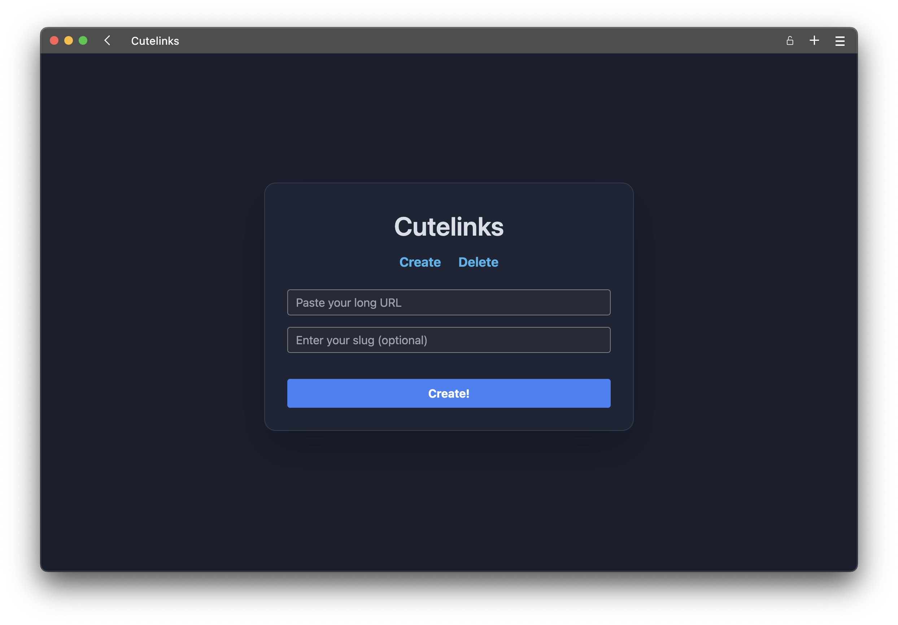

# Cutelinks :D

Whenever I've used a URL shortener, I've always been annoyed that there was no easy way to make a disposable and super short link. I wanted it to be deleted automatically after a certain amount of views or hours, and I wanted the slug to be as short as possible (so it's easy to enter on another device). Since I've been learning Web Dev, I figured I might as well build a url shortner that creates disposable links by default.

TODO:

- Finish Frontend (WIP)
- Finish Backend